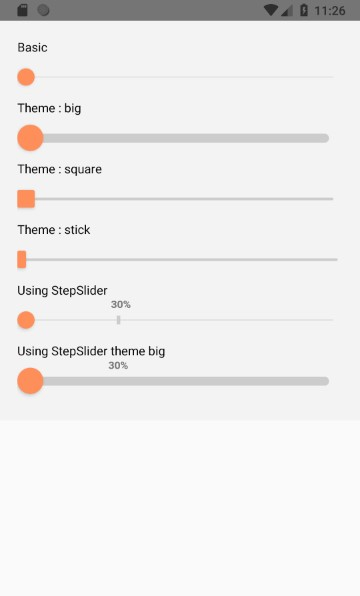
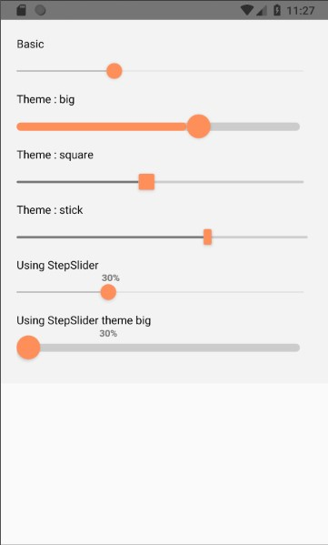

# react-native-slider

A pure JS slider for react-native, version 0.0.1

## Install
  npm install @phomea/react-native-slider
  
## Usage
    import {CustomSlider} from '@phomea/react-native-slider';
 
    <CustomSlider onChangeValue={this.onChangeValue} onSeek={this.onSeek} />

## Props

### onChangeValue : function(value)
A callback passing the final value

### onSeek : function(value)
A callback passing the value on seek

### intValue : boolean
**default : true**
If set to true will round the current value to integer

### handlerStyle
Style object to override the style of the handler

### steps : array
Define an array of steps you want on your slider.
Steps need to have this structure
    {
      value : number (required)
      label : string (optional)
    }
    
 ## Conclusion
 Feel free to clone the repo and make pull request or open new issues.
 
 If you like to contribute you can patron me:
 https://www.patreon.com/user?u=25858214
 
 
 made with ❤️ by Fabio Pocci
